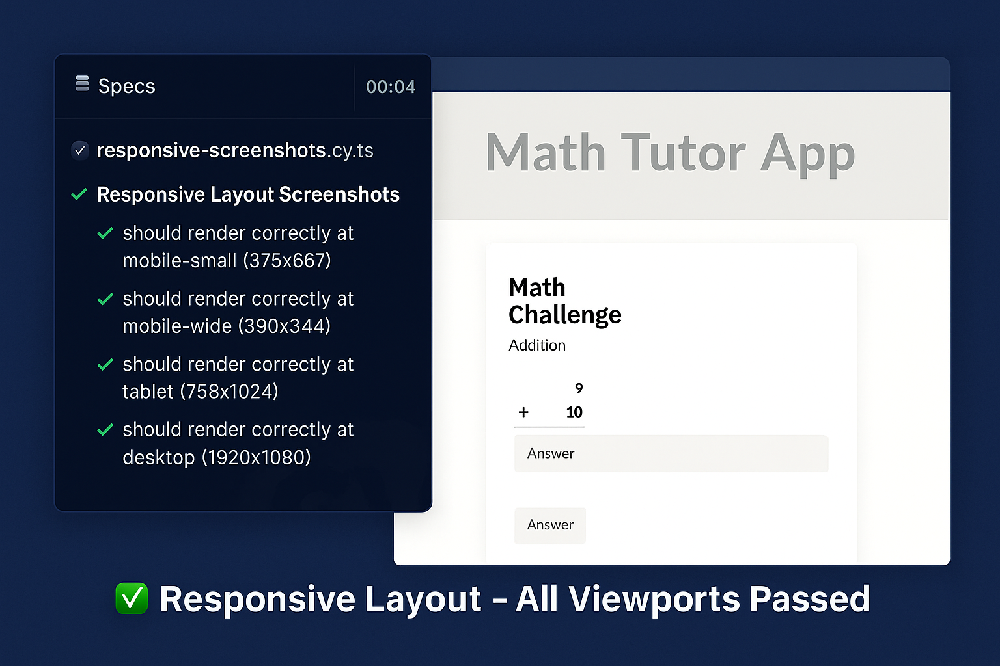
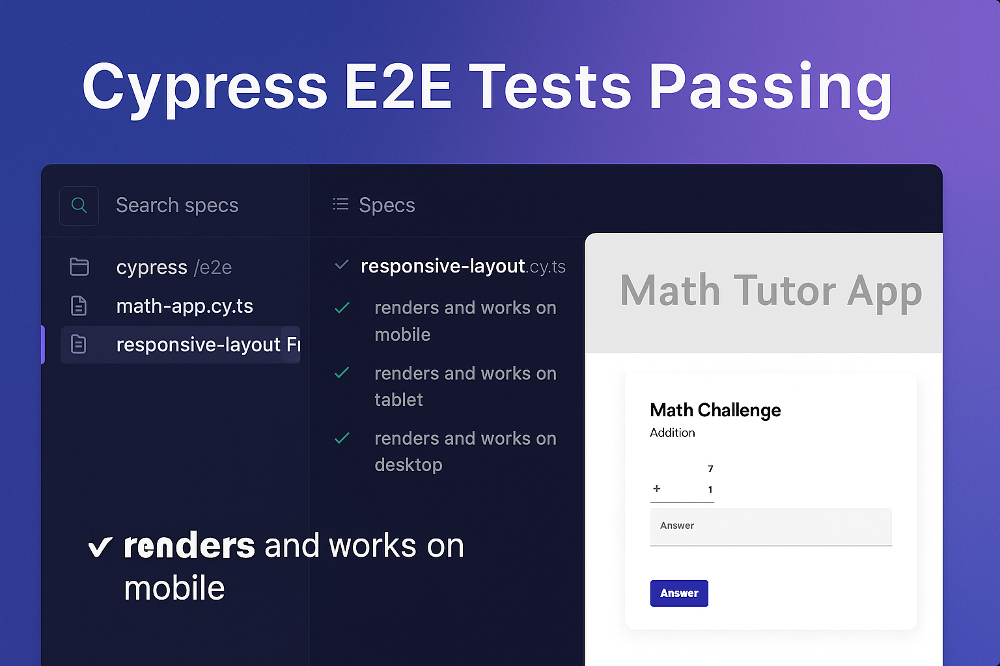
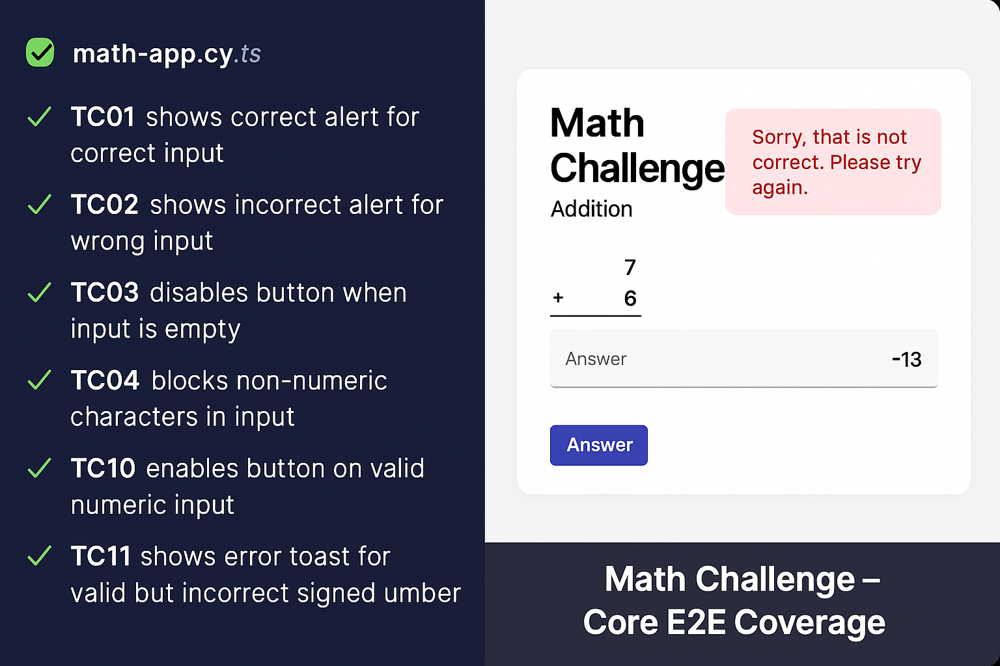
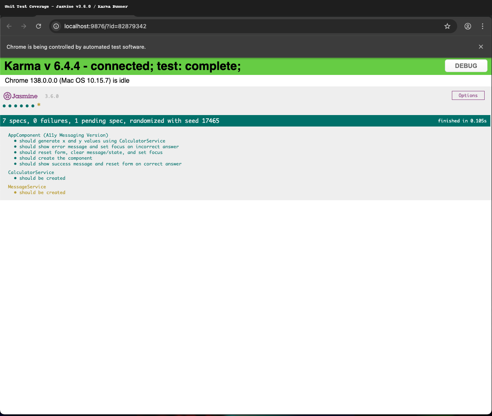

# Math Tutor App

This is the root README for the Math Tutor App project.


[](https://erikande.github.io/math-tutor-app/recruiter-showcase/)


## Overview

The Math Tutor App is a lightweight Angular application designed to help children practice basic arithmetic. This project was developed as part of a take-home assignment and showcases a complete test automation strategy suitable for a **Senior QA Engineer** role.

## 🌐 Live Demo

🎯 **Live App:**  
[https://erikande.github.io/math-tutor-app](https://erikande.github.io/math-tutor-app)

📸 **Recruiter QA Showcase:**  
A single-page visual summary with Cypress screenshots, test highlights, and a contact footer — built for quick recruiter review.
[https://erikande.github.io/math-tutor-app/recruiter-showcase/](https://erikande.github.io/math-tutor-app/recruiter-showcase/)


## 🔧 Available Commands

To support Cypress CI timing, the dev dependency `wait-on` should be installed:

```bash
npm install --save-dev wait-on
```

| Command            | Description                                       |
| ------------------ | ------------------------------------------------- |
| `start`            | Runs the Angular dev server                       |
| `build`            | Compiles app for production                       |
| `test`             | Runs Jasmine/Karma unit tests                     |
| `test:coverage`    | Runs unit tests and outputs code coverage to HTML |
| `lint`             | Lints the codebase using Angular linting rules    |
| `e2e`              | Runs E2E tests using Angular's e2e builder        |
| `cy:run`           | Runs Cypress tests in headless mode               |
| `cy:open`          | Opens Cypress in interactive mode                 |
| `cy:responsive`    | Cypress E2E tests across multiple breakpoints     |
| `audit:axe`        | Runs axe-core accessibility scan                  |
| `audit:lighthouse` | Runs Lighthouse performance audit                 |
| `audit:all`        | Runs Lighthouse + Axe + report generator          |
| `api:start`        | Starts mock API server                            |
| `help`             | Prints all available npm scripts                  |

---

## ⚙️ GitHub Actions Workflows

This project uses two GitHub Actions workflows to automate continuous integration:

* **unit-tests.yml** – Runs Jasmine + Karma tests in headless Chrome
* **cypress.yml** – Starts the Angular dev server and runs Cypress E2E tests

Both workflows run on every push and pull request to `main`, and their status is reflected in the README badge above.

---

## ✅ QA & Testing Strategy

* Jasmine unit tests (via `ng test`) ensure component logic and view logic are covered
* Cypress E2E tests simulate key user flows and cover accessibility, responsiveness, and layout
* Lighthouse CLI audit benchmarks initial load performance
* axe-core CLI audit ensures accessibility hygiene
* Audit results and screenshots are stored in `/audit` and `/cypress/screenshots`
* Responsive UI screenshots are already available in the section below, captured during Cypress E2E tests.

> 🟡 One spec is currently marked as `pending`: the `MessageService` creation test.
>
> This test was skipped due to Angular DI complexity around `ToastrService` and `TOAST_CONFIG`.
> Core message delegation is already verified indirectly via `AppComponent` tests.

---

## ✅ Cypress Test Coverage Summary

| Spec File                      | Coverage Area                                |
| ------------------------------ | -------------------------------------------- |
| `math-app.cy.ts`               | Basic app functionality (inputs, alerts)     |
| `responsive-layout.cy.ts`      | Layout behavior across breakpoints           |
| `responsive-screenshots.cy.ts` | Visual snapshots for audit and CI regression |

---


## 🧪 Responsive + Functional QA Screenshots

### ✅ All Viewports Passed


### 🧪 Functional Layout E2E


### 🔢 Math Challenge – Core Test Coverage (TC01–TC11)


### 🧪 Jasmine Unit Test Coverage



## 📊 Code Coverage

To generate a unit test coverage report (HTML + CLI summary):

```bash
npx ng test --code-coverage
```

**Output:** `./coverage/math-tutor-app/index.html`

Useful for identifying untested branches, functions, and statements.

💡 Open the HTML file in your browser to explore the interactive coverage dashboard.

### 📦 NPM Script

Also available via:

```bash
npm run test:coverage
```

### ⚠️ Coverage Reporting Status

Code coverage reporting is currently **scaffolded** using Angular CLI defaults and Karma + Jasmine. Reports generate correctly in HTML and CLI formats, but thresholds, CI enforcement, and branch-level coverage auditing are not yet implemented. Further configuration and validation are required to reach production-grade maturity.

---

## 📫 Contact

Project by [Erik Anderson](https://github.com/Erikande). For questions or feedback, feel free to open an issue.


---

## 🆕 Latest Release: v1.0.10 – Docs & QA Visual Patch

> Patch release focusing on UI screenshots and test coverage visual validation.
>
> 📌 No code changes — visual and documentation updates only.

### 🔍 What’s Included:
- Cypress screenshots from latest test runs
- Jasmine unit test summary capture
- Showcase updated with full QA media
- Polished README for LinkedIn visibility

➡️ [View Release Notes](https://github.com/Erikande/math-tutor-app/releases/tag/v1.0.10)

---

## 🔗 Repository

[https://github.com/Erikande/math-tutor-app](https://github.com/Erikande/math-tutor-app)

---

## 🔄 GitHub Pages Deployment

The project uses **separate deployment targets** for clarity:

### 🌐 Live App Deployment (`/`)

| Branch      | Path             | Notes                                      |
|-------------|------------------|--------------------------------------------|
| `gh-pages`  | `/`              | Deployed Angular app via `dist-ghp/`       |

Deployed using:

```bash
npx ng build --output-path dist-ghp --base-href /math-tutor-app/
git worktree add gh-pages
cp -r dist-ghp/* gh-pages/
git commit -m "Deploy Angular app via clean branch"
git push origin gh-pages --force
