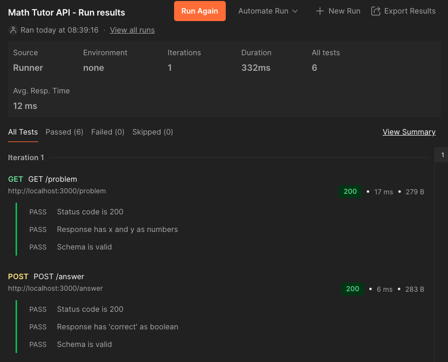

# Math Tutor App 🧮

This is a simple Angular-based math quiz app with integrated testing and CI/CD workflows.

## 🚀 Getting Started

Install dependencies:

```bash
npm install
```

Start the app locally:

```bash
npm start
```

Run unit tests:

```bash
npm run test
```

Run E2E tests:

```bash
npm run cy:run
```

## ✅ Test Coverage

| Type     | Framework   | Status |
|----------|-------------|--------|
| Unit     | Jasmine     | ✅     |
| E2E      | Cypress     | ✅     |
| Audit    | Lighthouse + axe-core | ✅     |
| API Test | Postman     | ✅     |

---

## 🦾 Automation & QA Enhancements

### 🔍 Accessibility & Performance Audits

Audits use Lighthouse and axe-core to evaluate the app's:

- Performance
- Accessibility (WCAG)
- SEO
- Best Practices

Run the full audit:

```bash
npm run audit:all
```

View the latest summary:

```bash
audit/summary.md
```

---

### 🧪 API Test Coverage (Postman)

[](../postman/math-tutor-api.postman_collection.json)

A lightweight Express API was added to simulate backend behavior. It is tested with Postman and includes:

- `GET /problem` – returns a random math problem
- `POST /answer` – checks correctness of answer

Tests include:

- ✅ Status code validation
- ✅ Property checks (e.g. `x`, `y`, `correct`)
- ✅ Schema validation via `tv4`
- ✅ Dynamic environment chaining (e.g. re-using `x`, `y`)

📸 **Example Run:**



🧾 Collection file: [math-tutor-api.postman_collection.json](../postman/math-tutor-api.postman_collection.json)

---

## 📂 Folder Structure

```
.
├── src/                   # Angular app
├── cypress/               # Cypress E2E tests
├── server/                # Express API server
├── scripts/               # Custom scripts (e.g. audit summary)
├── audit/                 # Lighthouse + axe-core JSON + summary
├── docs/                  # Static artifacts (Postman collection, screenshots)
```

---

## 🛠️ Scripts

| Script            | Description |
|-------------------|-------------|
| `start`           | Start Angular dev server |
| `test`            | Run Jasmine unit tests |
| `cy:run`          | Run Cypress E2E tests |
| `audit:all`       | Run Lighthouse + axe-core and generate Markdown summary |
| `api:start`       | Start Express API mock server (for Postman) |

---

##### © OneCause Take-Home Challenge
Crafted with care and quality by Erik Anderson 💻🧪
