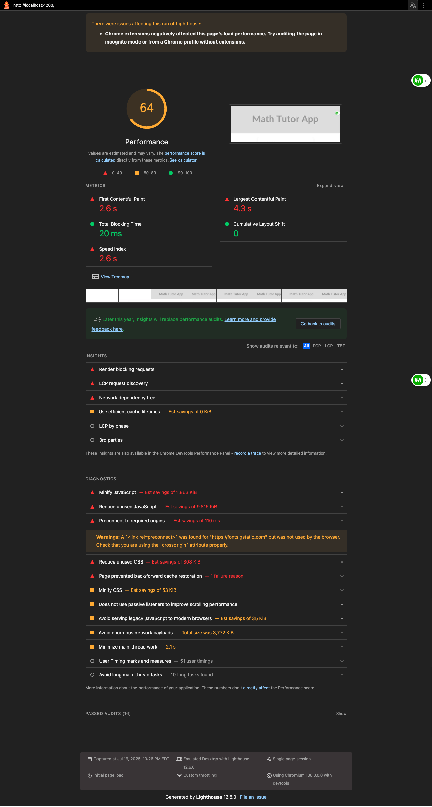
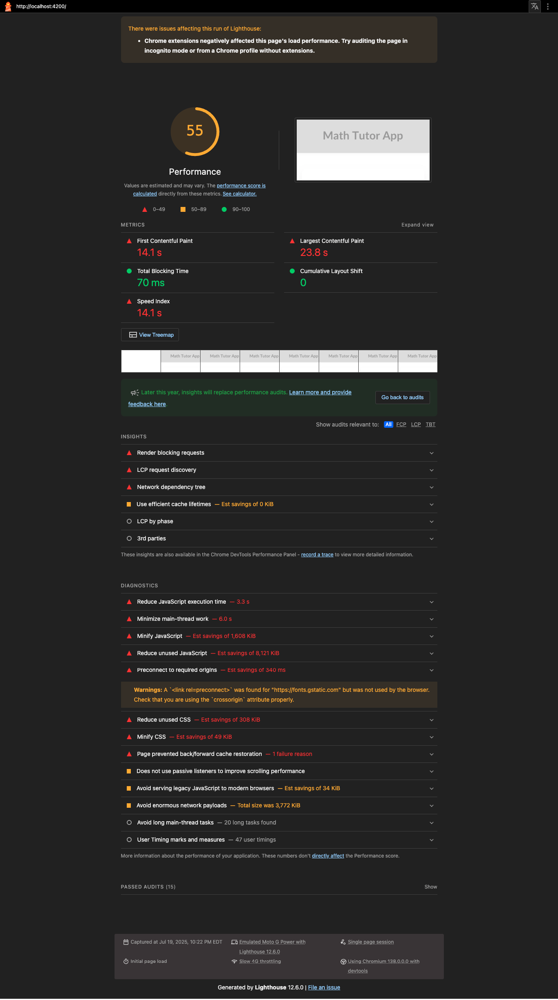

# 📸 UI Showcase – Responsive Proof

This document visually demonstrates the responsive layout coverage of the Math Tutor App. Screenshots were captured via Cypress using programmatic `cy.viewport()` simulation across common breakpoints.

All screenshots are real renderings from the app. See the `test-plan.md` file for viewport test descriptions and test logic.

---

## ✅ Banner Layout – Desktop

- 📐 Breakpoint: `macbook-13`
- ✅ Banner present and scaled
- ✅ Title and subtitle visible
- ✅ Layout preserves spacing

---

## ✅ Mobile – Modern Smartphones

- 📐 Breakpoint: `iphone-x`
- ✅ App title remains accessible
- ✅ Button and inputs scale to full width
- ✅ No horizontal scroll

---

## ✅ Mobile – Narrow Devices

- 📐 Breakpoint: `iphone-6`
- ✅ Touch targets remain usable
- ✅ Operator line-breaks respected
- ✅ Scroll region acceptable

---

## ✅ Mobile – Wide Format

- 📐 Breakpoint: `pixel-2`
- ✅ Consistent styling with modern devices
- ✅ Input padding preserved

---

## ✅ Tablet – Landscape

- 📐 Breakpoint: `ipad-2`
- ✅ Equations correctly aligned left
- ✅ Form field occupies available space

---

## 🔒 Visual Source

These screenshots are stored in `/docs/screenshots/` and were generated during the Cypress `responsive-screenshots.cy.ts` test.

---

For framed/UI-presented versions, see: [`slides/takehome-presentation.pdf`](../docs/slides/takehome-presentation.pdf).

## 📊 Performance & Accessibility Baseline

We used Lighthouse to establish a performance and SEO baseline.

- 📸 **Desktop:**  
  

- 📸 **Mobile:**  
  

- 📂 Full reports:
  - [audit/lh-desktop.json](../audit/lh-desktop.json)
  - [audit/lh-mobile.json](../audit/lh-mobile.json)
  - [audit/axe-latest.json](../audit/axe-latest.json)

See [`audit/summary.md`](../audit/summary.md) for a summary of key metrics.

## API Validation Snapshot

The following image shows the successful execution of the math-tutor Postman collection. This validates the availability and behavior of the API used in the app.

> Visual confirmation of successful Postman collection execution
